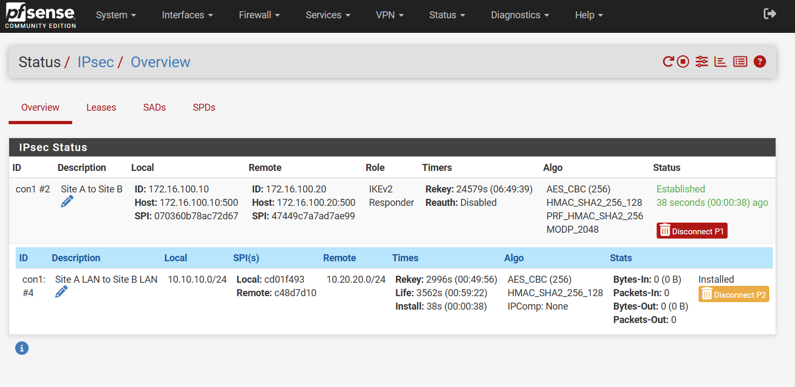
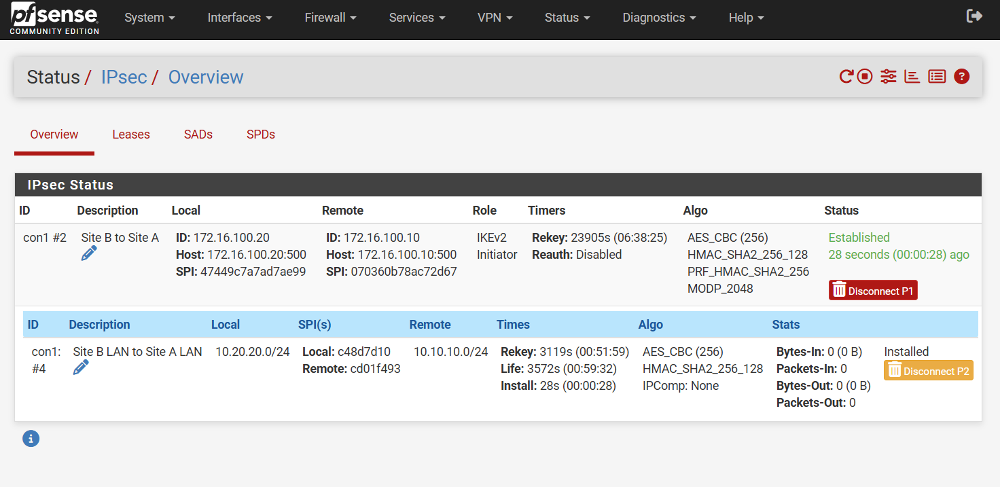
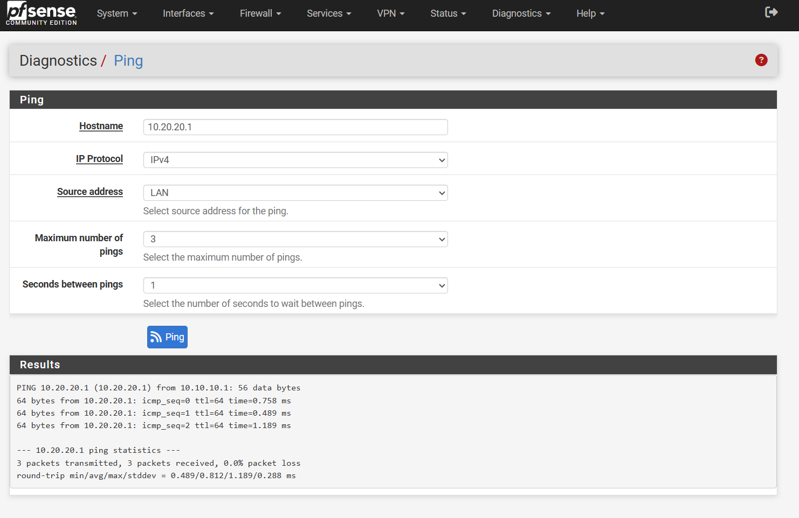
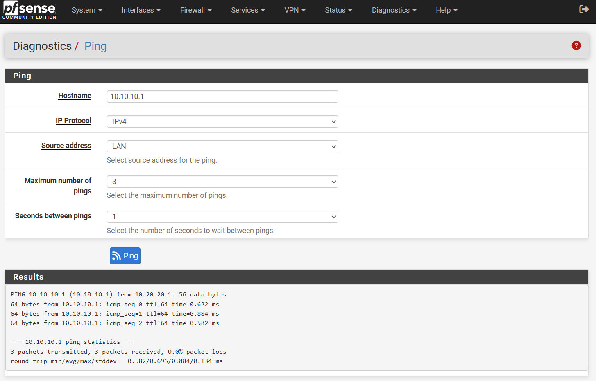

# Site-to-Site VPN Lab

## Project Overview

This project demonstrates the design, configuration, validation, and troubleshooting of an IPsec site-to-site VPN between two isolated private networks.

The lab uses Microsoft Hyper-V to create a virtual network environment and pfSense as the VPN endpoints. The goal is to establish secure communication between Site A and Site B while gaining hands-on experience with IPsec, IKEv2, firewall rules, virtual networking, security associations, and VPN troubleshooting.

## Objectives

- Build two isolated private networks in Hyper-V
- Configure pfSense as the VPN gateway for each site
- Configure an IPsec site-to-site VPN
- Configure matching IPsec Phase 1 and Phase 2 parameters
- Configure firewall rules to permit traffic across the VPN
- Verify secure connectivity between the two sites
- Validate VPN status and IPsec security associations
- Perform and document a controlled VPN troubleshooting scenario
- Document the completed architecture, configuration, and validation results

## Technologies

- Microsoft Hyper-V
- pfSense
- IPsec
- IKEv2
- TCP/IP
- Virtual Networking

## Network Architecture

| Site | Interface | IP Address / Network |
|------|-----------|----------------------|
| Site A | WAN | 172.16.100.10/24 |
| Site A | LAN | 10.10.10.1/24 |
| Site A | LAN Network | 10.10.10.0/24 |
| Site B | WAN | 172.16.100.20/24 |
| Site B | LAN | 10.20.20.1/24 |
| Site B | LAN Network | 10.20.20.0/24 |
| Transit Network | WAN | 172.16.100.0/24 |

## VPN Configuration

### IPsec Phase 1

- IKE Version: IKEv2
- Authentication: Pre-shared key
- Encryption: AES-256
- Integrity: SHA-256
- Diffie-Hellman Group: 14 (2048-bit)

### IPsec Phase 2

- Mode: Tunnel IPv4
- Protocol: ESP
- Encryption: AES-256
- Integrity: SHA-256
- PFS: Group 14
- Lifetime: 3600 seconds

### VPN Traffic Selectors

| Site | Local Network | Remote Network |
|------|---------------|----------------|
| Site A | 10.10.10.0/24 | 10.20.20.0/24 |
| Site B | 10.20.20.0/24 | 10.10.10.0/24 |

### Firewall Rules

IPsec firewall rules were configured on both pfSense endpoints to permit traffic between the remote site LAN and the local LAN.

## Validation

The completed VPN was validated through both tunnel-status verification and actual network traffic testing.

### Tunnel Validation

- Phase 1 IKE security association established successfully.
- Phase 2 Child SA established successfully.
- The final Phase 2 configuration negotiated AES-256 encryption.
- IPsec traffic counters confirmed that encrypted traffic was passing through the tunnel.

### Connectivity Testing

Connectivity was tested in both directions:

- Site A → Site B: `10.10.10.1` → `10.20.20.1`
- Site B → Site A: `10.20.20.1` → `10.10.10.1`
- Both directions achieved 0% packet loss.
- Tests were performed using the LAN interface as the source address to ensure traffic matched the configured IPsec traffic selectors.

## Validation Evidence

The repository includes screenshots documenting the completed VPN and connectivity tests.

### IPsec Tunnel Status

### Connectivity Testing

## Troubleshooting Scenario

A controlled Phase 2 configuration failure was introduced to test the ability to diagnose and recover from an IPsec negotiation problem.

### Intentional Failure

The Site B Phase 2 encryption proposal was changed from AES-256 to AES-GCM-128 while Site A remained configured for AES-256 only.

### Observed Behavior

Phase 1 successfully established, but Phase 2 failed to establish.

The IPsec status showed that only the IKE connection was established while the Child SA could not be created.

### Diagnostic Evidence

The pfSense IPsec log reported:

`failed to establish CHILD_SA, keeping IKE_SA`

This indicated that the IKE security association was functioning while the Child SA negotiation was failing.

### Root Cause

The Phase 2 encryption proposals on the two VPN endpoints did not match.

### Corrective Action

The Site B Phase 2 encryption proposal was restored to AES-256.

The configuration was applied and the existing security association was disconnected so that a fresh negotiation would occur.

The IPsec tunnel was then re-established successfully.

### Final Troubleshooting Validation

- Phase 1 re-established successfully.
- Phase 2 / Child SA re-established successfully.
- AES-256 was successfully negotiated.
- Site B → Site A connectivity was restored.
- Final connectivity test completed with 0% packet loss.

## Lessons Learned

- IPsec tunnel establishment involves separate Phase 1 and Phase 2 negotiations.
- A successful Phase 1 negotiation does not guarantee that the Phase 2 Child SA will establish.
- IPsec Phase 2 proposals must match between both VPN endpoints.
- Existing security associations may continue using previously negotiated parameters until they are disconnected and renegotiated.
- Selecting the correct source interface is important when testing policy-based IPsec traffic.
- Firewall rules must permit the intended traffic after the IPsec tunnel is established.
- IPsec logs provide useful diagnostic information when a Child SA fails to establish.
- Controlled configuration failures are useful for developing practical VPN troubleshooting skills.

## Project Status

**Status:** Complete

This lab successfully demonstrates the configuration, validation, and troubleshooting of a functional site-to-site IPsec VPN between two isolated private networks.
